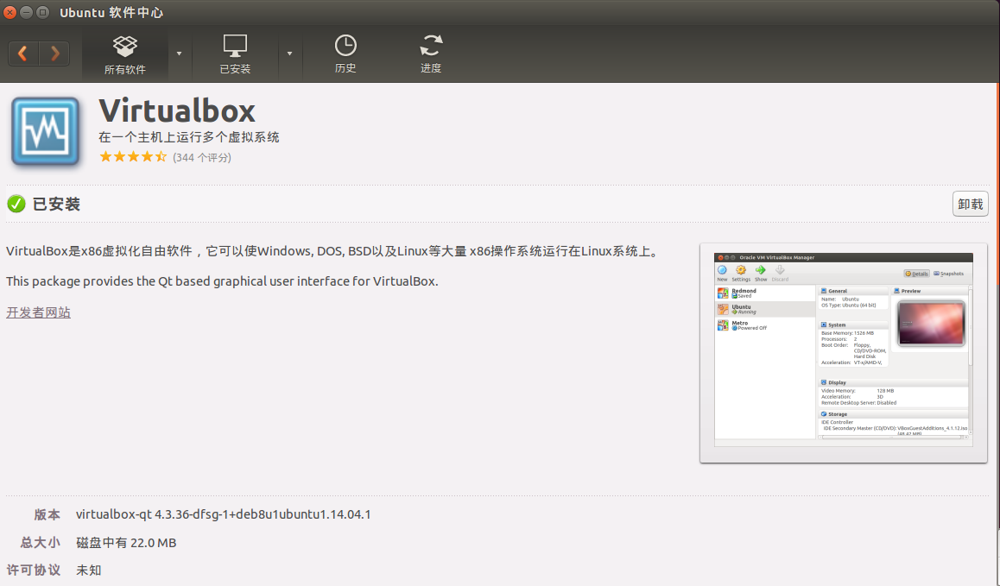

# 如何在ubuntu14.04系统安装虚拟机

* 首先，需要在ubuntu自带的软件中心下载安装一个虚拟机软件，我选择的是VirtualBox虚拟机软件；

* 安装完成后打开VirtualBox虚拟机软件，进入操作界面;

* 然后点击新建，弹出新建虚拟电脑对话框，输入虚拟电脑的名称并选择系统的类型，这里因为只有win7的映像文件，所以将名称设置为“Windows  7”，系统类型选择为“Microsoft Windows”，版本根据自己需要安装的系统自行选择，根据我的映像文件，我选择为“Windows 7（64-bits）”，单击下一步

* 创建Windows 7 虚拟机内存的大小，这里根据建议设置为 512MB，使用之后觉得512M的内存是真的小 ，用起来真的卡，刷新都会卡的那种，个人觉得1G左右才将就吧，而且还不能安装使用太大的软件，单击下一步

* 新建虚拟硬盘，这些硬盘用于存放在使用虚拟机的过程中产生的文件，选择第二个“现在创建虚拟硬盘”，单击创建

* 然后选择虚拟硬盘的文件类型，这个可以根据自身条件设置，这里我们选择最简单的，默认选项 "VDI(VirtualBox 磁盘映像)"，继续单击下一步

* 存储在物理硬盘的分配方式，根据安装的简介我们选择“动态分配”，下一步

* 选择虚拟机的文件位置和大小，可以输入虚拟机的名称（相当于新建一个以虚拟机名称而命名的文件夹）也可以选择电脑上原有的文件夹，这里我选择的是新建一个，这样方便查找，可以根据安装提示直接设置，但是我把他改的更大了一点，我把存储大小改为了 25 GB，然后点击创建，

* 这样一个虚拟机的基本架构就基本上设置完成了，接下来就是设置他的内在了，

* 单击“设置”按钮，选择“存储”选项，然后点击“没有盘片”，点击在分配光驱后面的小光盘标志，

* 选择下载在文件夹中的windows 7 系统镜像文件（.iso），单击确定按钮；

* 然后“启动”，出现了无法打开错误和警告错误：

### 重新建立一个虚拟机，我猜测是虚拟机系统版本选择错误导致的，所以我将虚拟机的系统更改为“Windows 7（32-bit）”，其余重复上述步骤操作，解决无法打开问题，接着继续虚拟机的配置：

* 单击菜单栏“启动”按钮

* 默认语言配置，“下一步”，

单击"现在安装"；

* 单击“我同意接受条款”的方框（打钩），然后“下一步”

* 选择你中意的安装类型，这里我选择了“自定义安装”

* 单击“驱动器选项”，选择“格式化”当前的分区，然后单击“下一步”

* 输入自己的设定的密码，最后单击“下一步”就可以安装完成进入使用页面了；

输入产品秘钥（有的下载的zip文件里有，没有的可以在网上搜索找到）

* 这样就进入windows 7  的操作页面了；

参考教程：viuturebox虚拟机安装windows7安装教程 —— https://jingyan.baidu.com/article/414eccf64ce6a36b431f0a93.html

